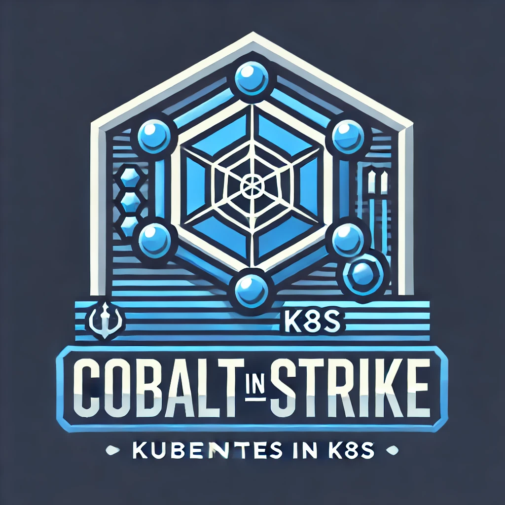

<h1>
  
  <span>Cobalt Strike in Kubernetes</span>
</h1>

**Using Cobalt Strike C2 server on Kubernetes.**

## Overview
Use this Helm-chart to run Cobalt Strike on k8s (k3s) clusters.
When launched, a StatefullSet is created that stores all your archives and files in the PV.
You need to take care of creating a service like LoadBalancer and free TCP and UDP ports.
## Features
* Saving data
* Port forwarding (LoadBalanser, NodePort or Ingress-controller port streaming)

```yaml
service:
  type: LoadBalancer
  ports:
    - name: admin
      port: 50050
      targetPort: 50050
      protocol: TCP
    - name: http-listener
      port: 80
      targetPort: 80
      protocol: TCP
    - name: https-listener
      port: 443
      targetPort: 443
      protocol: TCP
    - name: dns-udp-ls
      port: 53
      targetPort: 53
      protocol: UDP
    - name: dns-tcp-ls
      port: 53
      targetPort: 53
      protocol: TCP

```
You can change (customize) ports in `value.yaml`.
## Installation
Before running helm in k8s, you need to build a Docker image with Cobalt Strike. An example would be the `Dockerfile` from the repository.
### Prerequisites
* Kubernetes or k3s
* Helm install
* `kubectl` configured to authenticate to a Kubernetes cluster with a valid `kubeconfig` file
* Docker on local machine
### CLI
1. Clone repo.
```bash
git clone https://github.com/3ayazaya/cobalt-strike-k8s.git
cd cobalt-strike-k8s/charts
```

2. Build Docker image with Cobalt Strike (if you need it).

```bash
export BUILD_ARCHS="linux/amd64,linux/arm64"
docker buildx build --platform $BUILD_ARCHS --progress plain --pull -t <image:tag> --push . --no-cache
```
3. Change `values.yaml` if need in `charts` folder.
4. Install Helm-chart with Cobalt Strike in k8s (k3s) cluster.

```bash
helm install cobalt-strike cobalt-strike -f cobalt-strike/values.yaml -n <namespace> --create-namespace
```